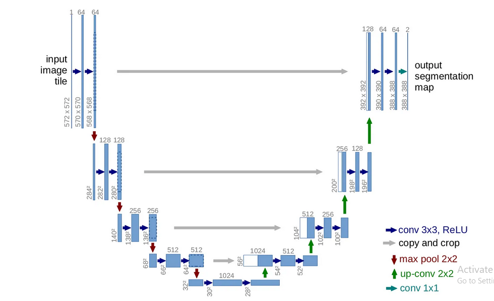

# U-Net Model

This repository contains the implementation of the U-Net model for image segmentation. The U-Net architecture is a popular choice for various image segmentation tasks due to its ability to capture both local and global context information. 🌟🔍

## 🏗️ Architecture
The U-Net architecture consists of an encoder and a decoder pathway. The encoder pathway downsamples the input image to extract high-level features, while the decoder pathway upsamples the feature maps and combines them with the corresponding feature maps from the encoder pathway to produce the final segmentation map.

## 📚 Dataset

The model is trained on the Oxford-IIIT pet dataset, available as part of the TensorFlow Datasets (TFDS). 🐾🐶🐱

## 💾 Weights File

The pre-trained weights file for the U-Net model can be downloaded from [here](https://drive.google.com/file/d/1MTEGHFUgMt1dBszSRrAgu6qaX6Lk8qmK/view?usp=drive_link). 

## 🔗 References

1. U-Net: Convolutional Networks for Biomedical Image Segmentation. [Link to the Paper](https://arxiv.org/abs/1505.04597) 📄🔬
2. The architecture of this model is based on the implementation provided by [PyImageSearch](https://pyimagesearch.com/2022/02/21/u-net-image-segmentation-in-keras/). 🖥️🚀

## ℹ️ Additional Information

For more detailed information about the U-Net model and its usage, please refer to the [info.txt](info.txt) file in this repository. 

Feel free to explore the repository and experiment with the U-Net model for image segmentation. If you have any questions or suggestions, please let me know! 😊✨

